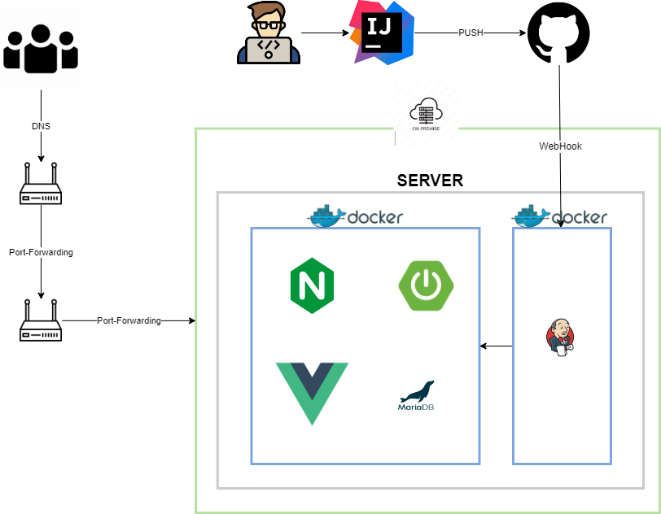

# Lawgg 프로젝트


## 목차
[1. 프로젝트 개요](#1-프로젝트-개요) <br>
[2. 프로젝트 구성도](#2-프로젝트-구성도) <br>
[3. 개발 환경 및 기술 스택](#3-개발-환경-및-기술-스택) <br>
[4. 개발 전략](#4-개발-전략) <br>
[5. 실행 방법](#5-실행-방법) <br>
[6. 기능](#6-기능) <br>
[7. 팀원 소개](#7-팀원-소개) <br>
[8. 기타 사항](#8-기타-사항) <br>
[9. 리팩 토링](#9-리팩-토링) <br>

## 1. 프로젝트 개요

------------
> 커뮤니티 서비스를 제공하며 `재판`이라는 흥미로운 소재를 함께 공유할 수 있는 서비스입니다. <br>
> 일반 적인 게시판 형태의 서비스를 통하여 웹 서비스에 기본을 개발 운영하며, 차별화 된 기능을 통하여 더욱이 섬세한 작업을 목표로 잡았습니다. <br>
> 익명의 다수의 사람들이 사용함으로써, 많은 유저들이 발생되었을 때 발생되는 트래픽을 생각하며 개발을 진행할 예정입니다. <br>

## 2. 프로젝트 구성도

------------



- 인프라 구성은 온프레미스로 구성하였으며, 서버는 도커를 이용하여 컨테이너 기반 서비스를 구축하였습니다. 
- jenkins, zabbix와 같은 다양한 툴을 이용하여 효율적인 운영을 진행하고자 하였습니다.

## 3. 개발 환경 및 기술 스택

------------

### Server
- Java 8
- Spring 2.7.15
- Maria DB 10.6.8

### 프론트
- vue.js 2
- node 16.13.0
- nginx 1.18.0

### Devops
- jenkis 2.4x
- docker 26.0.0
- zabbix
- gitub

### Tool
- intelliJ
- ubuntu-20.04

[목차로 이동](#목차)

## 4. 개발 전략

------------

### 배포 전략
> 롤링배포 + 블루/그린 배포 전략 선택 <br>
> TEST 컨테이너를 통하여 이상여부 확인 후, 서비스 전환

<br>

### 브랜치 전략
> Git-flow 전략을 기반으로 main, develop branch 와 feature 보조 브랜치 운용 <br>
> main, develop, feature 브랜치로 나누어 개발
> > main 브랜치: 배포 브랜치 <br>
> > develop 브랜치: 개발 단계에서 git-flow의 master 역할을 하는 브랜치 <br>
> > feature 브랜치: 기능 단위로 독립적인 개발 환경을 위하여 사용

[목차로 이동](#목차)

## 5 실행 방법

------------

### Vue.js

install
```angular2html
npm install
```

<br>

run

```angular2html
npm run serve
```


[목차로 이동](#목차)

## 6. 기능

------------
1. 포지션 게시판 기능
2. 트라이얼 기능
3. 로펌 기능
4. 자유 게시판 기능
5. 유저 기능

[목차로 이동](#목차)
## 7. 팀원 소개

------------

<div align="center">


|                         **김범신**                        |
|:--------------------------------------------------------:|
| [ <br/> @beomshinkim]() |

</div>

[목차로 이동](#목차)

## 8. 기타 사항

------------

- [API규격](http://123.com)
- [히스토리](http://123.com)
- [Backend Java 프로젝트](https://github.com/beomshin/lawgg-spring)

[목차로 이동](#목차)


## 9. 리팩 토링

------------

[2024.06.22]
> 현재 서비스 경우 vue-spring boot 구조로 소스가 파편화되어 단일 운영이 어려움을 느끼고 있다. 따라서 스프링 부트 타임리프를
> 적용하여 단일  WAS 서비스로 변경 구축하는것을 목표로 삼고 있다.

#### 계획
1. 기존 멀티 모듈 서비스를 단일 서비스로 변경한다.
2. 정적 리소스들을 취합하여 페이지 적용을 완료한다.
3. querydsl 기술을 mybatis로 변경하여 적용한다.
4. 소스 개선을 진행한다.
5. 기존 소스와 동일한 스펙의 API를 구성함으로써 온전한 서비스가 동작하는지 테스트를 진행한다.

[목차로 이동](#목차)